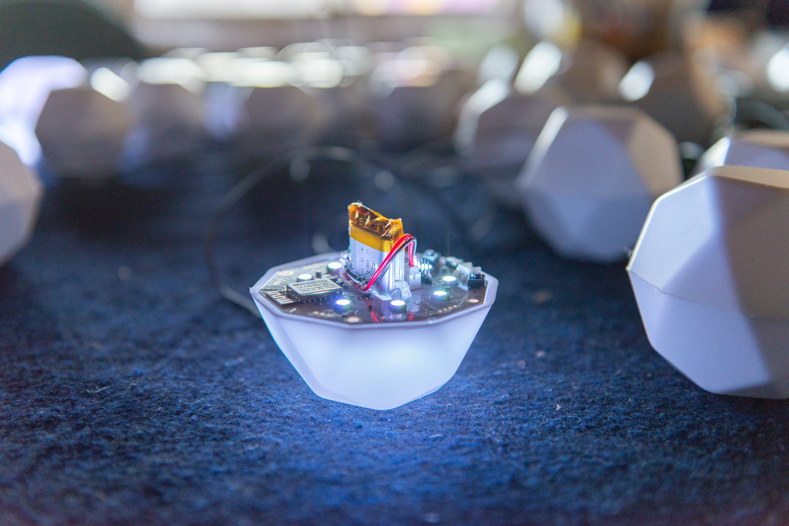
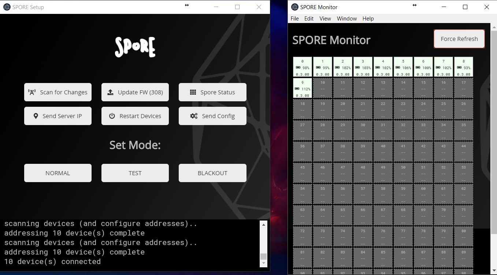

# Spore
The Spore system is a hardware and software platform that simplifies the process of creating with light. Each Spore is a softball-sized, WiFi-controlled, addressable, battery-operated, RGB LED module. This platform affords control of 1-1000+ Spores working together. The current version is optimized for about 100 Spores.

Spore was developed to showcase the potential of [Lightwork](https://github.com/PWRFLcreative/Lightwork). Lightwork uses computer vision to quickly map complex arrangements of addressable lights. Spore allows individually addressable LEDs to be placed in almost any arrangement, without any wiring for power and data. Used together, the the time to conceive and deploy a spatial light installation can be reduced from days to minutes.

With lots of options for input and output, Spore has many other possibilities for future uses. For example, wireless motor drivers that can be location mapped (using the LEDs + Lightwork); or accelerometer input to interact with individual lights; or reconfigurable, location aware sensor network interfaces, or lights that interpret the weather; or big Daniel Rozin-esque mirrors; etc...

### TODO
  * Motivations for the project
  * Stakeholders and contributors
  * Icosidodecahedron so it doesn’t roll all over.

## Basic Operation Requirements
  * Multicast capable Router + 802.11n Access Point (tested with Ubiquiti UAP-AC-LR + EdgeRouter X for ~100 devices). See network setup below.
  * JST-EH charger(s). 5V, ~520mA per Spore - we use a 5V 30A supply to charge 50 at a time
  * Source of sACN (E1.31) - generates the LED colors and transmits over the network
  * Between 1 and 100 Spores.

## Quick Start
TODO

## Table of Contents
* [Hardware](#hardware)
  + [Feature List](#feature-list)
  + [Dev Requirements](#dev-requirements)
  + [PCB Build/Assembly/Ordering](#pcb-buildassemblyordering)
  + [Battery](#battery)
  + [Enclosure](#enclosure)
  + [Network Setup](#network-setup)
* [Firmware](#firmware)
* [Software](#software)
* [OTA Firmware Updates](#ota-firmware-updates)

# Hardware
This section covers info on building and modifying the hardware, including the PCBs, batteries, prototyping, network setup, and enclosures.  

## Feature List
  * ESP8266 - An Arduino-compatible microcontroller with built-in wifi
  * 16 built-in addressable RGB LEDs (sk6812)
  * Built-in battery charger (@500mA)
  * Slot for 1800mAh lipo (single cell, 103450)
  * Lasts 6+ hours w/ 1800mAh cell
  * Breakout pins for:
    + more LEDs
    + built-in MOSFET (~2.5A)
    + I2C
    + analog input (reads VBatt by default)
    + motor output
    + servo output
  * sACN (E1.31) LED control over network
  * Fades to black if no data received for more than 3 seconds
  * Over-The-Air (OTA) updateable firmware (all at once!)

## Dev Requirements
Install KiCad and open it! -- The PCB was designed in [KiCad 4](http://kicad-pcb.org/). We recently did test import to KiCad 5 which seemed OK, but we haven’t tested exported files/gerbers yet. We usually check our gerbers using [gerbv](https://sourceforge.net/projects/gerbv/) and/or GerbView included in KiCad 5 (the one in KiCad 4 is not great).  

If you want to play with the firmware without actually building one of the boards, this is our recommended test hardware (but use what you have):

  * [Adafruit HUZZAH Feather](https://www.adafruit.com/product/2821)
  * [NeoPixel ring](https://www.adafruit.com/product/1463)
  * A single cell LiPo, ~500-2000mAh (e.g. [Adafruit 500mAh](https://www.adafruit.com/product/1578))

Connect the NeoPixel `Data Input` to `RX` on HUZZAH; NeoPixel `Power 5V DC` to `BAT` on HUZZAH; NeoPixel `Power Signal Ground` to `GND` on HUZZAH. This setup works great for other form-factors. You could build a whole system using these or something similar if you wanted!

>**Note:** The data pin must go to GPIO3 for DMA (Direct Memory Access) to work. DMA lets the ESP send data to the LEDs without flickering during WiFi events. Otherwise, WiFi events take enough processor cycles to throw off the timing for the super-sensitive neopixel-compatible LEDs.

## PCB Build/Assembly/Ordering
I’ve had good experience getting assembled boards from SAPA Technologies (http://www.sapatechs.com/) in the Vancouver BC area, and both assembled and unpopulated boards from PCBWay and Elecrow in China (but there are lots that are good). Local fabs generally do better, faster work, and allow you to come visit/send couriers/perform tests to make sure things happen right the first time; but it is naturally more expensive (I’ve found 40-100% more). Cheaper chinese assemblers do a fine job, but it can take a little longer, communication is slow (time zones!), and you kinda get one shot at a time. One run I did in China had a silly mistake made by the fabricator that needed to be fully re-done twice. That put us over 6 weeks behind schedule. Apart from that, I recommend ordering at least 15% over what you actually need if ordering overseas, and more like 5-10% or less for local (depending on your test procedures and quantities).

>**Note:** Assembled means “with all the components soldered on”. Turnkey assembly means “source and buy all the components for me, and then solder them on”. Unpopulated (usually called PCB Manufacturing, or PCB Prototype) means, “just the PCB” and I am responsible for sourcing, buying, and soldering the components.

We usually order our components for local assembly or prototyping from Digikey. I recommend getting addressable LEDs from [Shiji Lighting](http://www.shiji-led.com/) if you are doing a bunch. They have consistent quality, excellent service, and good prices. You can use RGB or RGBW sk6812s for this board. I think we didn’t use APA102s/sk9822s to save pins - we needed more free pins for an earlier design concept. That later changed but it was too late to switch back. Feel free to modify the boards for other LED protocols if you prefer!

#### PCB Requirements:
  * 2 layers
  * HASL (cheaper) or ENIG/Immersion Gold Finish (a little more corrosion resistant)
  * 1.6mm thickness
  * White Solder Mask (PCB Color) - we think white helps reflect LED light outward vs dark PCB, but do what you want!

## Battery
SPOREs are designed to use a 103450, 1800mAh lipo battery with JST PHR-2 connector. You can use a different battery, just make sure the polarity of the PHR-2 connector matches, and it is at least 500mAh. The charge current is set with R6 on the Spore board.

We sourced our batteries from General Electronics Battery Co. (http://www.gebattery.co/) and were very happy with the service and quality. You may have to order 100+ batteries with them as they are an OEM supplier. Otherwise check Adafruit/Sparkfun or your local electronics or hobby shop (FYI shipping LiPos from USA to Canada is a pain in the neck).

To install the batteries, we built a simple wooden jig to center and square them in the PCB, tacked them with hot glue, and glued them in with RTV silicone. RTV silicone adheres well to the PCB and the battery, and absorbs shocks without releasing or cracking. It can also handle temperature swings without the bond weakening (e.g. maybe it’s cold outside then your LEDs heat up the board). Make sure it is RTV (room temperature vulcanizing), as neither Silicone I or Silicone II (typical bathroom or door/window sealants) have these properties.

>**Hot Tip:** You can usually find RTV Silicone in the automotive section of Canadian Tire or Home Depot. You can also get it at Princess Auto and Walmart. We love that stuff.

## Enclosure
Files for the enclosure are located here: link
This includes a model that can be 3D printed or vacuum formed, and a 2D folded style shell that can be made from paper or translucent sheet material.

We made our shells of vacuum formed, ⅛”, white, Sign-Grade Lexan with the help of the folks at Dimension 3 (http://dimension3plastics.com/). Most of ours are hot-glued together (using a high-temperature gun), so we can easily reconfigure them. For more permanent bonds, we’ve had good luck with heavy duty contact cement, 3M 4475 (industrial plastic adhesive), and BSI Maxi-Cure (high quality extra thick CA).

## Network Setup
This is specifically for the Ubiquiti EdgeRouter X with a UAP access point.
  * w/ appropriate SSID & Password
  * Configured to disable multicast filtering
  * Configured to set minimum data transmission rates
  * Configure UniFi to use a different port from 8080

# Firmware
## Dev Requirements
**TODO more detail**
  * Arduino 1.8.6+
  * Esp Core 2.4.2 (may not work with older or newer version)
  * Library versions: **TODO** (see my excel doc)
  * FTDI or USB-Serial with compatible pinout. 5V vcc required, 3.3v logic recommended (e.g. [Adafruit CP2104](https://www.adafruit.com/product/3309))
    + (there is some debate about the 5V tolerance of the ESP8266 pins)

## Installation/Build instructions
**TODO more detail**
  * Arduino, esp core, library installation
  * ESP settings
  * Physical connections
  * Set SSID and Password

Hold the bootload while resetting to upload new firmware.  
⚠️ **YOU MUST reset the board at least once after uploading new firmware with FTDI or OTA WILL NOT WORK** ⚠️

# Software
**TODO more detail**
The Spore Configuration App is a tool to configure and monitor the Spores. It was built in Node.js using the Electron framework. It should work on Mac, Windows, and GNU/Linux out of the box.

In the near future, we will export compiled binaries for all platforms, but for now, you need to install it using Node.js, and all dependencies should be automatically downloaded on `npm install` (see [below](#installationbuild-instructions)).

## Feature List
  * Automatically set a unique address for each spore on the network
  * OTA firmware updates
  * Monitor battery level and status of connected spores
    + Red outline of a Spore indicates low battery warning
    + Flashing 🔌/⚠️ icons on a Spore indicate critical battery level
  * Identify individual spores (make a single one light up!) by clicking on it in the Monitor
  * Change modes on all spores:
    + Normal (receive sACN)
    + Test (light up with white, pulsing animation)
    + Blackout (turn off all LEDs)
  * Not required for normal operation of Spores - just a handy tool useful for reconfiguring and troubleshooting

## Dev Requirements
  * Node.js 8 LTS (we developed with v8.11. probably v8.12 is OK, but not yet tested)
  * Decent Javascript-friendly text editor (e.g. Atom, VS Code)

## Installation/Build Instructions
  1. Make sure Node.js is installed (type `node -v` in terminal to verify version. You need v8.11 or v8.12. DO NOT use v10.x+ unless you are ready to fix some stuff
  2. Clone or download and extract this repo to a nice home
  3. Open terminal/cmd
  4. cd to `<this repo>/configApp/` folder in terminal
  5. Type `npm install` to download and install dependencies (will take a few minutes)
  6. Type `npm start` to run

# OTA Firmware Updates
The OTA Firmware updates the firmware on ALL SPOREs connected to the configurator. When the button is pressed, the server sends a message to each SPORE with the latest version number. The SPORE checks to see if this is newer than it’s current version. If yes, then it downloads and installs whichever firmware is in the <this repo>/server//firmware folder.

**TODO: Finish this thought**  
This requires a few manual changes each time BUT that is not necessarily a bad thing.

  * ⚠️ OTA firmware should not be done willy-nilly.
  * ⚠️ You can definitely soft-brick all of your devices by uploading untested firmware.
  * ⚠️ You can break OTA capabilities with untested firmware.
  * ⚠️ Firmware should be testing on a single device before OTA uploads.

Breaking OTA or soft-bricking devices requires updating firmware with FTDI for all of them - I’ve done it, and I don’t recommend it.
Operation
TODO?

# FAQ
#### What is sACN?
Streaming ACN (sACN), aka ANSI E1.31, is a protocol developed by ESTA to efficiently transport DMX universes over a network. In other words, it is a standard way to control lights over a local network. It is comparable to ArtNET in many aspects. If you’ve ever been to a concert, the stage lights were controlled by DMX, ArtNet, and/or sACN.

Key features are that it uses multicast sockets which reduces network overhead and makes setup easier, and that it has a much higher universe limit of 63,999 vs Artnet’s 32,768. We have also been previously frustrated by apparently mixed standards/version of Artnet (read: it’s broken AF), whereas sACN is an ANSI standard and the implementations we’ve found all seem to work with each other.

#### Do I need the Spore Configurator App?
Maybe. The config app simplifies addressing and firmware updates on lots of devices. You could manage this manually for a small number of devices (i.e. hard-code the address and program with an FTDI). In general, once the devices have been configured once, you don’t need the app running. However, it is very helpful to be able to see connection status, battery status, and firmware version. Also, the remote `Restart Devices` and `Test Mode` are both quick ways to solve problems in the field (“Have you tried turning it off and on?”).

#### Do I need a fancy and expensive router and/or access point?
Depends! For large numbers of devices, access point and router configuration options become more important. In theory, with some good network administration, you should be able to control 1000+ SPOREs. For only a few devices (< 20 or so), any router that supports multicast should work fine, but routers are picky and weird. We can’t promise anything but it doesn’t hurt to try! If you are using your home router, maybe turn off Netflix first.

#### What software can control the SPORE LEDs?
Anything that can send sACN/e1.31 over network. We’ve tested with Lightwork (our own project built in Processing), Touchdesigner (DMX Out Chop), Processing (e131 library), and QLC+ (open source lighting control app). LED control software like Madrix or mapping software like MadMapper should also work. You can use tools like the Open Lighting Architecture (OLA, https://www.openlighting.org/ola/) to communicate with software like Max/MSP, PureData, etc. You could also write some of your own stuff - Arduino, Node.js, c++, python, and others all have sACN libraries available. Or you could modify the SPORE firmware to receive OSC or ArtNet instead.

TD Lightwork: https://github.com/timrolls/TD-Lightwork

# Known Issues & Workarounds
**Multiple websockets handshake thing** - for now, if a device isn’t connected or repeatedly connects, or repeated disconnects - send the `restart devices` command (there is a behaviour in the server that attempts to filter this out, it make take a couple of minutes if your server or router has crashed or been unplugged during operation)

**Address Collision** - currently the system allows multiple devices to have the same address. This has been intentionally allowed for now. If you want each device to have a unique address, press `scan for changes`. HOWEVER, this will readdress everything which will most likely BREAK your Lightwork mapping. Make sure you have all your devices figured out and address before you map them with Lightwork.

**Changing the Configurator App `config.json` file** - Whenever this is changed, you should restart the App. Making this more robust is on the future todo list, but it should be so rarely used that restarting the app isn’t the end of the world
See github issues for more!

# TODO:
Here are some things that might be done in the future. If you want to contribute to the project it might be a good place to start! In no particular order:

  - [ ] See github issues for broken things!
  - [ ] Export Configurator App as standalone app. For now, you need to install and run it as a dev from your chosen terminal. See the Electron documentation.
  - [ ] Make a SPORE DEMO mode. This should show off capabilities when there is no server or wifi available, or on a button press.
  - [ ] Migrate to Node.js 10 (wait until October for LTS)
  - [ ] Make the firmware server more automatic (drag & drop, rename file, auto-extract version or enter version in GUI)
  - [ ] Make editing the config.json file work better - could be auto-restart server, could be notifies with a warning whenever it changes (i.e. “config file has changed, server restart required”), could be dynamically reload all config values.
  - [ ] Add sleep mode to SPOREs (currently sleep mode is labelled as “blackout” which is also helpful). Would be good to be able to sleep the spores to save battery power if they need to be installed ahead of time. Decisions need to be made about how long between wakeups (to connect to network and check if it’s time to get to work), and which sleep mode to go into.
  - [ ] SPOREs receive other data - Maybe you send it Audio-Reactive OSC or something?
  - [ ] SPOREs transmit streaming data (i.e. streaming their sensor data) - what format, how fast, etc.
  - [ ] Add ArtNet support (we chose sACN because it is more robust, but ArtNet is more widely supported)
  - [ ] Port configurator to Android (wouldn’t it be nice if this whole thing were running on your phone) - or fork to create a non-electron version that serve to a browser etc.

## Credits

Spore is a collaboration between Tangible Interaction http://www.tangibleinteraction.com/ and Makerlabs http://www.makerlabs.com/, made possible by the Creative BC Interactive Fund https://www.creativebc.com/programs/development-funding/interactive-fund ( copy Logos from Lightwork repo )

Individual contributors include:
	Tim Rolls - Concept, Director and Developer
	Leó Stefánsson - Lightwork Developer
	Brendan Matkin - Spore Hardware and Firmware design
	Alex Beim - Spore concept
	Andrea Buttarini - Spore design

List Volunteers??

